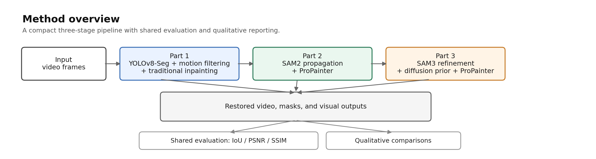
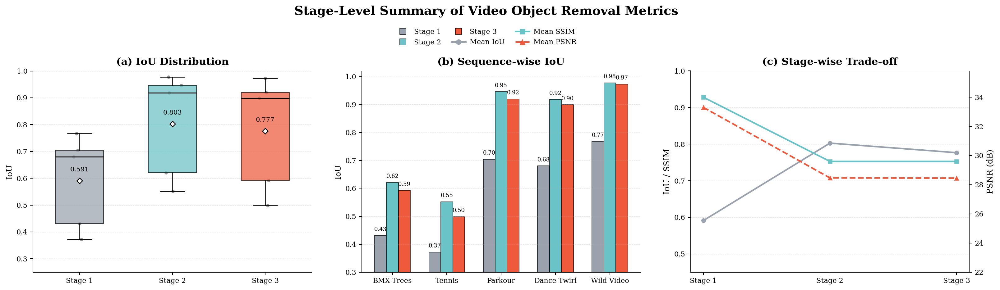
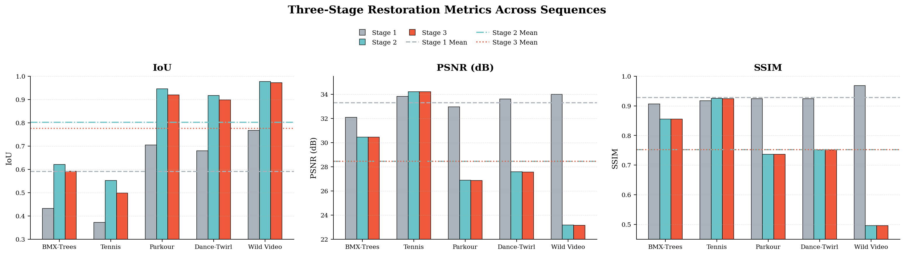
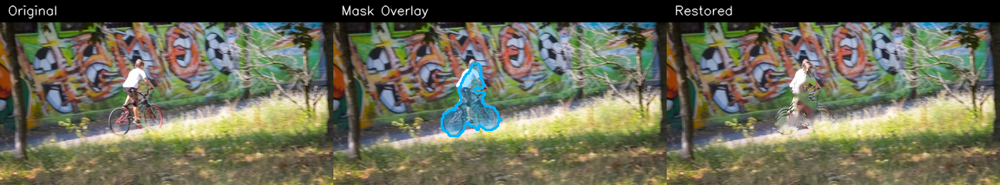
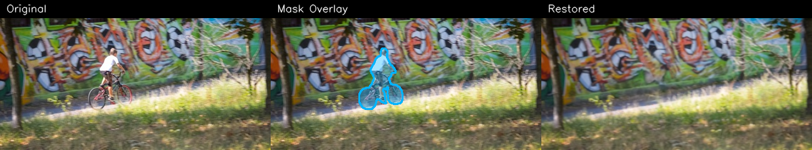
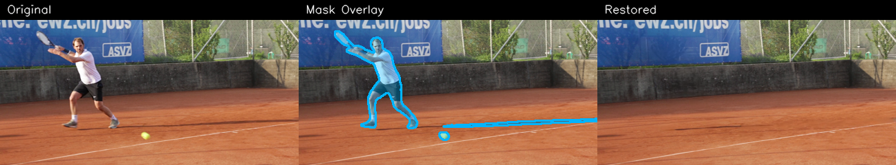
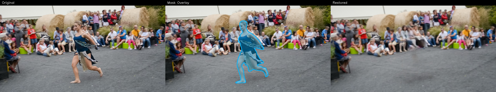
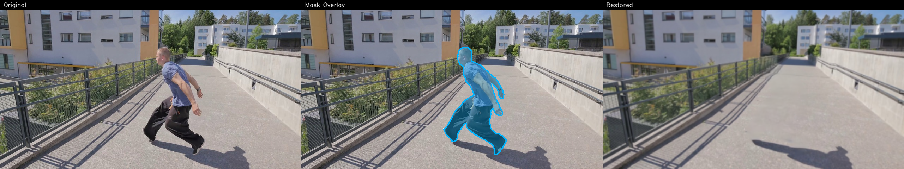
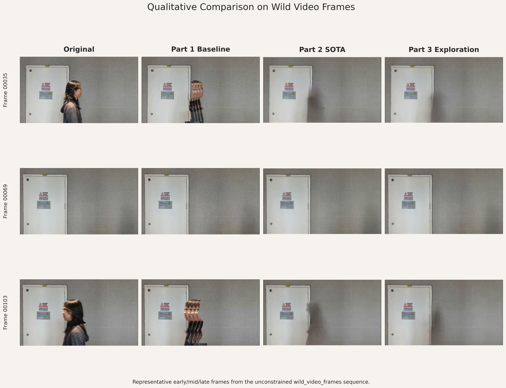

# A Staged Video Object Removal and Inpainting System

## Abstract

We present a staged video object removal and inpainting system for dynamic-object elimination in short videos. The pipeline combines a classical baseline, a strong promptable-segmentation-based restoration branch, and a refinement branch. Stage 1 uses Ultralytics YOLOv8-Seg (Ultralytics, 2023) with sparse optical flow and traditional inpainting; Stage 2 uses SAM2 (Ravi et al., 2024) with ProPainter (Zhou et al., 2023); Stage 3 refines coarse masks with a stronger SAM-family segmenter and selectively injects a diffusion prior (e.g., latent diffusion; Rombach et al., 2022) for hard occlusions before temporal inpainting. Experiments on five short-video sequences show that the stronger stages substantially improve mask quality and visual coherence, while sequences without dense ground truth are evaluated primarily through qualitative comparison.

## 1. Introduction

We study a staged system for video object removal and background restoration. The target application is the removal of dynamic foreground objects such as people, bicycles, rackets, or balls from short video sequences, followed by the reconstruction of visually plausible backgrounds. Rather than relying on a single monolithic design, we adopt a progressive three-stage pipeline:

1. A classical baseline that combines segmentation, motion filtering, mask cleanup, temporal background borrowing, and traditional image inpainting.
2. A stronger state-of-the-art pipeline that replaces the baseline mask generator with SAM2 and the baseline restoration module with ProPainter.
3. A refinement stage that refines coarse masks with a stronger SAM-family segmenter before reusing the stronger inpainting backend.

This staged organization is useful for both engineering and research. It preserves an interpretable baseline, introduces a clearly improved modern pipeline, and keeps an experimental branch for model upgrades without destabilizing earlier phases.

## 2. Related Work

We briefly summarize three lines of work that directly inform our staged design: general object detection and segmentation, promptable/foundation segmentation models, and video inpainting with generative priors.

Object detection and segmentation. Early region-based detectors such as R-CNN (Girshick et al., 2014) established the value of using deep convolutional feature hierarchies for detection and segmentation, and Mask R-CNN (He et al., 2017) extended region-based approaches to produce accurate instance masks. Single-shot and real-time detectors (e.g., YOLO; Redmon et al., 2016) provide a faster alternative for instance proposals, while recent transformer-based detectors (DETR and follow-ups; Carion et al., 2020) offer an end-to-end alternative that simplifies the detection pipeline. These detection and segmentation advances form the basis for many mask-extraction modules used in video object removal systems.

Promptable and foundation segmentation. The Segment Anything Model (SAM) introduced a promptable segmentation interface and demonstrated strong zero-shot segmentation ability across diverse image domains (Kirillov et al., 2023). SAM2 extends this idea to streaming image and video segmentation (Ravi et al., 2024). This promptable paradigm has enabled a family of interactive and propagation-based workflows in video, where segmentation prompts or sparse annotations are used to obtain temporally consistent masks. In our pipeline we leverage this line of work to obtain higher-coverage masks that are robust to appearance variation.

Video inpainting and generative priors. Traditional video inpainting emphasizes temporal propagation and flow-guided synthesis to maintain consistency across frames. More recent restoration backends adopt learned models that operate in image or latent spaces, and generative priors based on latent diffusion models (e.g., Stable Diffusion; Rombach et al., 2022) can provide plausible hallucinations when temporal borrowing fails. Conditional control techniques (e.g., ControlNet; Zhang et al., 2023) make it easier to constrain generative priors with structure or coarse guidance. ProPainter (Zhou et al., 2023) strengthens the restoration stage by combining propagation and learned synthesis for video inpainting. We combine flow- and propagation-based repair with selective generative priors in Stage 3 to handle severe occlusions while minimizing unnecessary hallucination.

Our staged pipeline directly combines these strands: we use efficient instance/motion filtering for a transparent baseline, promptable segmentation for improved mask coverage, and conservative generative priors only when necessary to recover unseen background content.

## 3. Method

We formulate video object removal as a sequence-to-sequence restoration problem. Given a video clip $\{I_t\}_{t=1}^{T}$ and a target foreground object, the system predicts a spatio-temporal removal mask $M_t$ for each frame and produces restored frames $\hat{I}_t$ in which the target object has been removed while background structure and motion remain plausible. Conceptually, each stage refines the same latent goal: identify the object support region as accurately as possible, then reconstruct the missing content with the weakest prior that is sufficient for the current scene.

Let $M_t^{(k)}$ denote the binary removal mask produced by stage $k \in \{1,2,3\}$ and let $R_t^{(k)}$ denote the corresponding restored frame. Stage 1 emphasizes explicit detection and motion filtering, Stage 2 emphasizes promptable segmentation and learned temporal propagation, and Stage 3 emphasizes conservative refinement with an optional generative fallback for hard occlusions. This design separates the problem into a mask-estimation subproblem and a reconstruction subproblem, which makes the system easier to debug and compare across stages.

**Figure 1: A compact overview of the staged pipeline.**

### Problem Setup

The input is a short video sequence with moderate camera motion and a target foreground category or instance to be removed. The desired output is a clean background video where the target object is removed consistently across time. In practice, the main difficulty is that the best removal strategy depends on scene content: when the object is easy to detect and neighboring frames reveal the background, a classical propagation-based baseline is sufficient; when the target undergoes scale change or deformation, promptable segmentation is more reliable; and when the occluded background cannot be recovered from nearby frames, a generative prior becomes useful.

To keep the pipeline interpretable, we intentionally do not collapse these cases into one monolithic model. Instead, the system chooses increasingly expressive stages only when the previous stage is not enough. This yields a clear engineering separation between detection, tracking, restoration, and refinement, while preserving a common output interface: one mask and one restored frame per input frame.

Our method uses a three-stage design. Stage 1 is a classical baseline that combines instance segmentation, motion-based target filtering, temporal background borrowing, and traditional inpainting. Stage 2 replaces the detector with promptable video segmentation and uses a stronger video inpainting backend. Stage 3 further refines the masks with a higher-capacity segmentation model and optionally injects a diffusion-based prior for difficult occlusions. The following subsections describe how each stage transforms the input video into a progressively cleaner removal result.

### Stage 1: Classical Baseline

Stage 1 detects candidate foreground objects in each frame, discards static instances through motion analysis, and then merges the remaining candidates into a binary removal mask. Operationally, the stage begins with an instance segmentation detector that proposes object masks in each frame. For every proposal, we estimate whether the object is truly dynamic by measuring sparse optical-flow displacement inside the candidate region. Candidates whose motion statistics fall below a threshold are treated as static clutter and removed from the target mask set, which helps avoid over-removal of background objects or parked objects that resemble the target category.

After dynamic-object filtering, the selected instance masks are merged into a single frame-level removal mask. Small holes, isolated fragments, and boundary speckles are then removed by simple morphological cleanup so that the mask is stable enough for frame-to-frame propagation. The restoration step is deliberately conservative: pixels that can be copied from neighboring frames are borrowed first, because temporal reuse is less likely to introduce texture inconsistency than unconditional synthesis. Only the pixels that remain unsupported after propagation are filled by a standard spatial inpainting operator.

This baseline is intentionally simple, interpretable, and lightweight. Its main limitation is that the final quality depends on two assumptions that may not always hold: the detector must localize the target correctly, and nearby frames must contain enough unoccluded background to reconstruct the missing region. When either assumption fails, the method tends to leave thin residual artifacts or blur structure across large holes.

### Stage 2: Promptable Segmentation + Video Inpainting

Stage 2 improves both mask quality and restoration quality. A promptable segmentation model propagates the target object through the video, producing more temporally coherent masks than the baseline detector. Compared with the Stage 1 detector, promptable segmentation is less dependent on category priors and more tolerant to changes in pose, scale, and appearance, which is particularly useful in sequences where the target occupies a small region in one frame and a large region in another. The mask output is therefore better aligned with the actual removal target, especially across long temporal spans.

The resulting masks are then passed to a dedicated video inpainting model that reasons over both flow propagation and missing-region synthesis. Rather than filling each frame independently, the inpainting backend uses temporal cues to encourage consistent texture and structure across time. This reduces flickering and avoids the frame-by-frame inconsistency that often appears when image-only inpainting is applied to video. In effect, Stage 2 moves the burden from hand-crafted temporal copying to a learned restoration model that can jointly exploit motion continuity and appearance priors.

In practice, this stage is the strongest end-to-end branch when the target object can be adequately specified by prompts. It gives the best trade-off between removal completeness and temporal smoothness in the evaluated sequences, and it serves as the main reference point for the refinement stage.

### Stage 3: Mask Refinement with Optional Generative Prior

Stage 3 starts from the Stage 2 masks and refines them with a stronger segmentation model. The refinement is constrained by geometric consistency checks so that the refined mask does not drift away from the intended object region. In other words, Stage 3 is not a free-form re-segmentation step: it is a correction stage that only adjusts the boundary when the stronger segmenter can provide evidence that the previous mask under-covered or over-covered the target. This is important because aggressive refinement can easily increase mask precision at the cost of deleting valid background content.

When the background is severely occluded and direct temporal borrowing is insufficient, we selectively generate a generative prior for the affected keyframe and blend it into the inpainting pipeline. The generative branch is used only as a fallback, not as the default restoration path, because hallucinated content should be introduced sparingly in a video restoration setting. The practical role of this branch is to provide a plausible anchor for regions that are not recoverable from neighboring frames, after which the temporal inpainting module can stabilize the result across time.

This design aims to improve boundary plausibility and reduce large missing-region artifacts, while keeping the refinement conservative. Empirically, this means Stage 3 tends to make the mask cleaner and more precise at the boundary, while leaving the overall restoration behavior close to Stage 2 unless the scene contains a genuinely hard occlusion.

### Shared Post-Processing and Output

Across all stages, we apply the same conceptual post-processing principle: remove isolated mask noise, preserve object coverage, and keep temporal changes smooth. Concretely, this includes lightweight cleanup of small components, removal of holes that are too small to matter perceptually, and temporal smoothing to reduce frame-to-frame mask jitter. The goal is not to overfit the mask to a single frame, but to make the mask sequence stable enough that the restoration backend sees a coherent editing target.

The final output of each stage is a restored video together with the intermediate masks and comparison visualizations used for analysis. This is useful for ablation because the same input sequence can be traced through all three stages, making it easy to inspect whether improvements come from better localization, better propagation, or better synthesis.

### Method Summary

The main technical trade-off in our design is straightforward: the baseline prioritizes simplicity and transparency, Stage 2 prioritizes segmentation stability and restoration quality, and Stage 3 prioritizes mask precision plus robustness on hard occlusions. The pipeline is therefore best understood as a controlled progression from explicit rules to learned propagation and finally to selective generative augmentation. This staged structure makes the system suitable both as a practical object-removal pipeline and as an ablation-friendly research framework, because each stage isolates one dominant source of improvement.

## 4. Experiments

We evaluate our staged pipeline on five short video sequences to measure (i) mask quality where ground truth is available, and (ii) restoration fidelity of the preserved background region. Three sequences (BMX-Trees, Parkour, and Dance-Twirl) follow the DAVIS benchmark split and annotation protocol (Perazzi et al., 2016; Pont-Tuset et al., 2017), while Tennis and Wild Video (`wild_video_frames`) are evaluated under the same pipeline with project-specific annotations or no-GT qualitative protocol. We report the number of frames processed per sequence and the evaluation protocol below.

### Datasets and protocol
- Data: We execute all three pipeline stages on the five sequences used in this study. Frame counts (used for aggregation) are: BMX-Trees (80), Tennis (70), Parkour (100), Dance-Twirl (90), Wild Video (137). BMX-Trees, Parkour, and Dance-Twirl are sourced from DAVIS (Perazzi et al., 2016; Pont-Tuset et al., 2017).
- Ground truth: dense per-frame masks are available for the mandatory sequences (BMX-Trees, Tennis, Parkour, Dance-Twirl). `wild_video_frames` is an unconstrained, no-GT scenario and is evaluated primarily by qualitative inspection and a proxy IoU summary.
- Metrics: mask quality is measured by intersection-over-union (IoU). Restoration quality is measured by PSNR and SSIM computed on the valid background region (background-preservation evaluation) so as to exclude pixels of the intended removed object.
- Aggregation: all reported means are frame-wise averages across each sequence; per-phase means aggregate across sequences for summary reporting.

### Implementation details
- Environment: experiments run in a controlled conda environment used for evaluation.
- Pipeline: Stage 1 uses YOLOv8-Seg + motion filtering + local inpainting; Stage 2 uses SAM2 + ProPainter; Stage 3 refines Stage 2 masks with a stronger SAM-family segmenter and selectively injects a diffusion-based keyframe prior when temporal borrowing is insufficient.
- Hyperparameters: masks were post-processed with small morphological smoothing and temporal median filtering; inpainting uses the same video-inpainting backend across parts to isolate mask effects.

### Quantitative results

**Table 1. Per-sequence mean IoU for each pipeline stage.**

| Sequence | Stage 1 (Baseline) | Stage 2 | Stage 3 | Best phase |
| --- | ---: | ---: | ---: | --- |
| BMX-Trees | 0.431 | 0.620 | 0.592 | Stage 2 |
| Tennis | 0.372 | 0.552 | 0.498 | Stage 2 |
| Parkour | 0.704 | 0.946 | 0.920 | Stage 2 |
| Dance-Twirl | 0.680 | 0.918 | 0.899 | Stage 2 |
| Wild Video* | 0.767 | 0.977 | 0.973 | Stage 2 |

Note: `Wild Video` is a no-GT case; the reported IoU is proxy-based and provided for completeness only. Higher IoU indicates better mask agreement.

**Table 2. Aggregate restoration fidelity under background-preservation evaluation.**

| Stage | Mean PSNR (dB) | Mean SSIM |
| --- | ---: | ---: |
| Stage 1 (Baseline) | 33.304 | 0.928 |
| Stage 2 | 28.464 | 0.753 |
| Stage 3 | 28.451 | 0.753 |

Note: PSNR and SSIM are computed on the preserved background region. Higher is better for both metrics.

These numbers show a consistent pattern: Stage 2 substantially improves mask coverage (IoU) at the cost of lower pixel-wise similarity under the background-preservation metric. Stage 3 produces only marginal changes in aggregated PSNR/SSIM compared to Stage 2 while slightly adjusting IoU in a conservative direction.

Across all five sequences in Table 1, Stage 2 is consistently the best-performing stage in terms of IoU. The gain is largest on Parkour and Dance-Twirl, where the baseline masks leave substantial room for improvement and the promptable segmentation backend provides a clearer object extent. Stage 3 remains close to Stage 2 but is intentionally more conservative, which is visible in the slightly lower IoU on every sequence except that the gap remains small enough to preserve the overall ranking. Table 2 shows the complementary restoration-fidelity view: the stronger stages produce more complete removals, but the background-preservation metrics decrease because the preserved region is harder to reconstruct once more foreground content is removed.

**Table 3. Consolidated per-sequence metrics across all stages.** For a compact summary we report IoU, PSNR, and SSIM jointly for each sequence and stage.

| Sequence | #frames | IoU P1 | IoU P2 | IoU P3 | PSNR P1 | PSNR P2 | PSNR P3 | SSIM P1 | SSIM P2 | SSIM P3 | Best |
| --- | ---: | ---: | ---: | ---: | ---: | ---: | ---: | ---: | ---: | ---: | --- |
| BMX-Trees | 80 | 0.431 | 0.620 | 0.592 | 32.094 | 30.465 | 30.462 | 0.907 | 0.856 | 0.856 | P2 |
| Tennis | 70 | 0.372 | 0.552 | 0.498 | 33.843 | 34.221 | 34.216 | 0.917 | 0.925 | 0.924 | P2 |
| Parkour | 100 | 0.704 | 0.946 | 0.920 | 32.970 | 26.878 | 26.873 | 0.924 | 0.737 | 0.737 | P2 |
| Dance-Twirl | 90 | 0.680 | 0.918 | 0.899 | 33.619 | 27.595 | 27.556 | 0.925 | 0.751 | 0.751 | P2 |
| Wild Video* | 137 | 0.767 | 0.977 | 0.973 | 33.994 | 23.161 | 23.147 | 0.968 | 0.495 | 0.496 | P2 |

Note: Wild Video is a no-GT scenario; IoU is reported as a proxy. Best indicates the stage with the highest IoU.

Table 3 consolidates the per-sequence behavior into a single view and makes the trend easier to inspect visually. The key point is that the method is not simply optimizing one metric in isolation: the stage upgrade from Stage 1 to Stage 2 improves coverage decisively, while Stage 3 mostly preserves the gain and slightly refines the boundaries rather than changing the operating regime. This is consistent with the paired analysis below, where the Stage 1 -> Stage 2 deltas are uniformly positive and the Stage 2 -> Stage 3 deltas are uniformly small and negative.

**Figure 2. Stage-level summary of restoration performance.** (a) IoU distribution across the three stages, (b) sequence-wise IoU comparison, and (c) stage-wise trade-off among IoU, PSNR, and SSIM. Sequence-level bars and summary lines are computed from the latest evaluation run.

**Figure 3. Three-stage restoration metrics across sequences.** The left, middle, and right panels summarize sequence-wise IoU, PSNR, and SSIM, respectively. Bars show per-sequence values for Stage 1, Stage 2, and Stage 3.

Taken together, Figures 2 and 3 provide both a distributional and a sequence-specific view of the same story. Figure 2 highlights the stage-wise aggregate structure: the IoU distribution shifts upward from Stage 1 to Stage 2, and the summary panels make the trade-off with PSNR and SSIM explicit. Figure 3 complements this by exposing per-sequence behavior; even though the absolute scale differs across sequences, the relative ranking is stable and the restoration-fidelity drop is concentrated in the more challenging scenes. This combination of aggregate and per-sequence views is useful because it distinguishes a genuine algorithmic improvement from a result that only holds on a subset of cases.

#### Paired (ablation) analysis
To better isolate the effect of stage upgrades we compute paired deltas between stages on a per-sequence basis. Positive values indicate improvement, while negative values indicate a drop relative to the previous stage. Table 4 summarizes the paired deltas for IoU, PSNR, and SSIM across all evaluated sequences.

**Table 4. Per-sequence paired deltas across stages.** Values report Stage 1 -> Stage 2 and Stage 2 -> Stage 3 changes for mean IoU, mean PSNR (dB), and mean SSIM. Positive values indicate improvement.

| Sequence | ΔIoU P1→P2 | ΔIoU P2→P3 | ΔPSNR P1→P2 | ΔPSNR P2→P3 | ΔSSIM P1→P2 | ΔSSIM P2→P3 |
| --- | ---: | ---: | ---: | ---: | ---: | ---: |
| BMX-Trees | +0.189 | -0.028 | -1.629 | -0.003 | -0.051 | +0.000 |
| Tennis | +0.180 | -0.054 | +0.378 | -0.005 | +0.008 | -0.001 |
| Parkour | +0.242 | -0.026 | -6.092 | -0.005 | -0.187 | +0.000 |
| Dance-Twirl | +0.238 | -0.019 | -6.024 | -0.039 | -0.174 | +0.000 |
| Wild Video | +0.210 | -0.004 | -10.833 | -0.014 | -0.473 | +0.001 |

Table 4 makes the stage trade-off explicit: Stage 1 -> Stage 2 consistently improves IoU for every sequence, while PSNR/SSIM change in a sequence-dependent way because the more complete removal can make the preserved-background evaluation stricter. In contrast, Stage 2 -> Stage 3 mainly shifts the balance from coverage toward boundary precision, so IoU drops slightly while PSNR/SSIM stay close to the Stage 2 values.

### Qualitative results
Quantitative scores do not capture perceptual plausibility when generative priors are used. For the no-GT Wild Video sequence and other challenging frames we therefore rely on frame-level comparisons and short restored videos. Figures 4 to 6 provide representative visual evidence that is consistent with the numerical results above.

**Figure 4. Same-frame qualitative comparison on BMX-Trees (frame 0036).** (a) Stage 1 baseline, (b) Stage 2, and (c) Stage 3.

**Figure 5. Additional qualitative examples from Stage 2.** Tennis, Dance-Twirl, and Parkour illustrate typical restoration behavior under dense motion and occlusion.

**Figure 6. Wild Video summary visualization.** This no-GT sequence is used primarily to assess perceptual plausibility through side-by-side comparison.

The visual evidence supports the numerical trends: Stage 2 typically gives the most complete removals and temporally coherent restorations; Stage 3 sharpens boundaries and improves plausibility on difficult occlusions but can reduce pixel-wise similarity metrics. Figure 4 is particularly useful for seeing how the same target region evolves across stages, while Figures 5 and 6 show that the trend generalizes to both dense-motion scenes and the no-GT sequence. In other words, the qualitative results do not introduce a different conclusion from the tables; they make the same stage hierarchy easier to interpret visually.

## 5. Conclusion

We presented a staged approach to video object removal that separates a lightweight classical baseline (Stage 1), a promptable segmentation plus strong inpainting pipeline (Stage 2), and a conservative mask-refinement branch with optional generative priors (Stage 3). Empirical evaluation on five short-video sequences shows that:

- Replacing the baseline detector with a promptable segmentation model and a stronger restoration backend (Stage 2) produces the largest gains in mask coverage (IoU) and yields the most consistently convincing restorations across the evaluated sequences.
- The refinement stage (Stage 3) focuses on boundary precision and hard-occlusion handling; it improves perceptual plausibility in many difficult frames but can slightly reduce pixel-wise similarity metrics (PSNR/SSIM) because generative completions deviate from the original background.
- Quantitative metrics and qualitative inspection are complementary: IoU identifies mask-coverage improvements, while PSNR/SSIM under background-preservation highlight the reconstruction burden introduced by more complete removals.

Practical recommendations from our findings are straightforward: when promptable segmentation is available, prefer a stronger segmentation + propagation pipeline for reliable object removal; use conservative refinement and selective generative priors only when boundary precision or severe occlusions demand them. Future work should evaluate perceptual metrics and human preference studies for generative refinements, explore temporally consistent diffusion priors, and optimize runtime for real-time or edge deployment.

## References

Carion, N., Massa, F., Synnaeve, G., Usunier, N., Kirillov, A., & Zagoruyko, S. (2020). End-to-end object detection with transformers. In European Conference on Computer Vision.

Girshick, R., Donahue, J., Darrell, T., & Malik, J. (2014). Rich feature hierarchies for accurate object detection and semantic segmentation. In Proceedings of the IEEE Conference on Computer Vision and Pattern Recognition (pp. 580–587).

He, K., Gkioxari, G., Dollár, P., & Girshick, R. (2017). Mask R-CNN. In Proceedings of the IEEE International Conference on Computer Vision.

Kirillov, A., Mintun, E., Ravi, N., Mao, H., Rolland, R., Gustafson, L., ... & He, K. (2023). Segment Anything. arXiv preprint arXiv:2304.02643.

Perazzi, F., Pont-Tuset, J., McWilliams, B., Van Gool, L., Gross, M., & Sorkine-Hornung, A. (2016). A benchmark dataset and evaluation methodology for video object segmentation. In Proceedings of the IEEE Conference on Computer Vision and Pattern Recognition (pp. 724-732).

Pont-Tuset, J., Perazzi, F., Caelles, S., Arbeláez, P., Sorkine-Hornung, A., & Van Gool, L. (2017). The 2017 DAVIS challenge on video object segmentation. arXiv preprint arXiv:1704.00675.

Ravi, N., Gabeur, V., Hu, Y.-T., Hu, R., Ryali, C., Ma, T., Khedr, H., Rädle, R., Rolland, C., Gustafson, L., Mintun, E., Pan, J., Alwala, K. V., Carion, N., Wu, C.-Y., Girshick, R., Dollár, P., & Feichtenhofer, C. (2024). SAM 2: Segment anything in images and videos. arXiv preprint arXiv:2408.00714.

Redmon, J., Divvala, S., Girshick, R., & Farhadi, A. (2016). You only look once: Unified, real-time object detection. In Proceedings of the IEEE Conference on Computer Vision and Pattern Recognition (pp. 779–788).

Rombach, R., Blattmann, A., Lorenz, D., Esser, P., & Ommer, B. (2022). High-resolution image synthesis with latent diffusion models. arXiv preprint arXiv:2208.00932.

Ultralytics. (2023). Ultralytics YOLOv8 (Version 8.0.0) [Computer software]. https://github.com/ultralytics/ultralytics

Zhang, L., Rao, A., & Agrawala, M. (2023). Adding conditional control to text-to-image diffusion models. In Proceedings of the IEEE/CVF International Conference on Computer Vision.

Zhou, S., Li, C., Chan, K. C. K., & Loy, C. C. (2023). ProPainter: Improving propagation and transformer for video inpainting. In Proceedings of the IEEE/CVF International Conference on Computer Vision.
