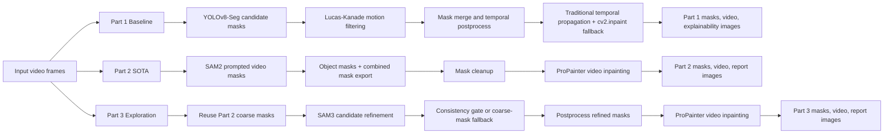
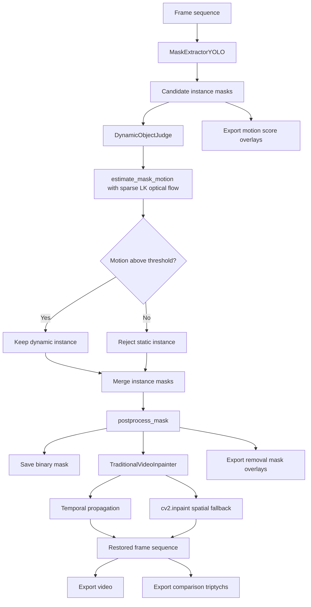
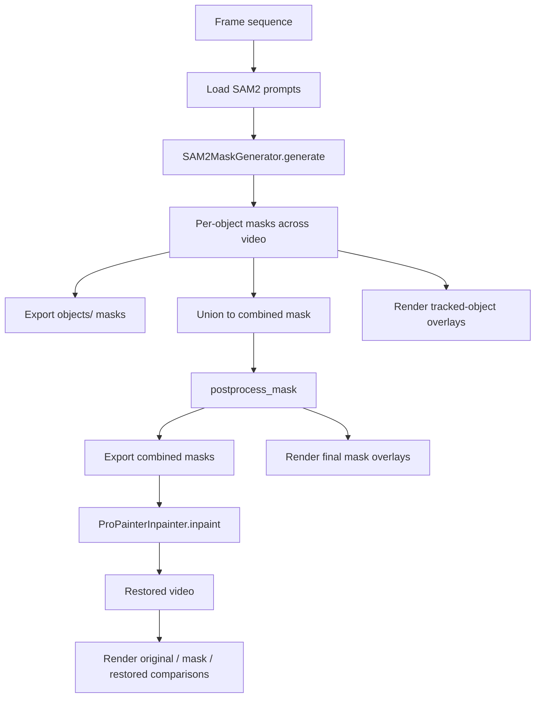
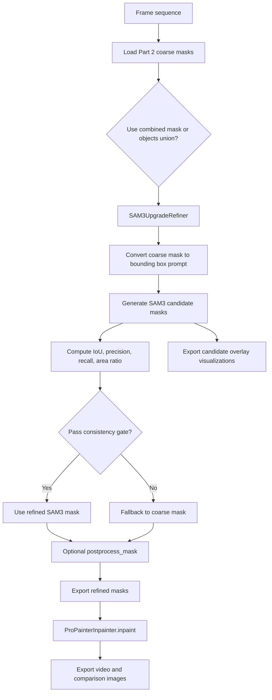

# 可视化流程图文本

本目录用于存放报告中 Method / Pipeline flowchart 的文字底稿。内容同时对齐两部分来源：

- `Overall_Plan.md` 中对 Part 1 / Part 2 / Part 3 的任务拆解
- `src/` 中已经实现并跑通的真实流程

当前代码里的实际输出路径为：

- `results/visualizations/part1/{sequence_name}/`
- `results/visualizations/part2/{sequence_name}/`
- `results/visualizations/part3/{sequence_name}/`

其中每个 phase 都会导出三类图像：

- `motion_scores/`: 候选目标或候选掩码解释图
- `mask_overlays/`: 最终 removal mask 叠加图
- `comparisons/`: original / mask overlay / restored 三联图

## 总体方法流程图

## Part 1: Baseline 流程图文本

对应实现：

- `src/part1_baseline/pipeline_part1.py`
- `src/part1_baseline/mask_extraction_yolo.py`
- `src/part1_baseline/dynamic_judgment.py`
- `src/part1_baseline/inpaint_traditional.py`

建议图注：

Part 1 以 YOLOv8-Seg 生成候选实例，再用稀疏 Lucas-Kanade 光流判断目标是否真正运动，最后通过传统时序传播与 OpenCV inpainting 进行修复。该流程可解释性强，但在大遮挡和复杂纹理区域容易出现模糊与结构断裂。

## Part 2: SOTA 流程图文本

对应实现：

- `src/part2_sota/pipeline_part2.py`
- `src/part2_sota/mask_sam2.py`
- `src/part2_sota/inpaint_pro_painter.py`
- `configs/part2_sota.yaml`

建议图注：

Part 2 使用基于 prompt 的 SAM2 进行视频目标分割，再将多目标掩码融合为单一 removal mask，输入 ProPainter 进行时序一致的视频修复。与 Part 1 相比，该阶段显著提升了遮挡区域的纹理连续性和整体视觉质量。

## Part 3: Exploration 流程图文本

对应实现：

- `src/part3_exploration/pipeline_part3.py`
- `src/part3_exploration/sam3_upgrade.py`
- `configs/part3_exploration.yaml`

建议图注：

Part 3 将 Part 2 生成的 coarse mask 作为先验，通过 SAM3 对边界进行再细化，并使用一致性门控防止 refinement 过度偏离原始目标区域。若候选掩码不满足约束，则回退到 coarse mask，以保证鲁棒性。

## 报告中推荐的流程图摆放方式

1. Method 总图使用“总体方法流程图”。
2. Part 1 / Part 2 / Part 3 各自的小图可放在 Method 或 Appendix 中。
3. 若版面有限，正文保留一张总图，再在 caption 中概括三阶段差异：

   - Part 1: YOLO + optical flow + traditional inpainting
   - Part 2: SAM2 + ProPainter
   - Part 3: Part 2 coarse mask + SAM3 refinement + ProPainter